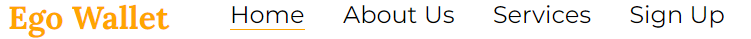
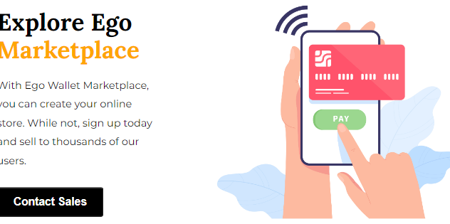
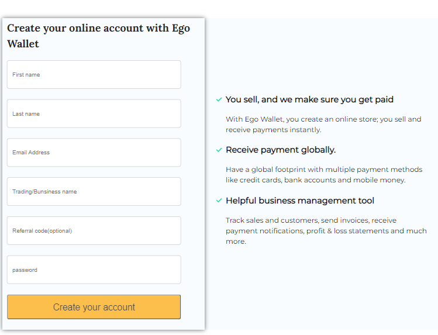
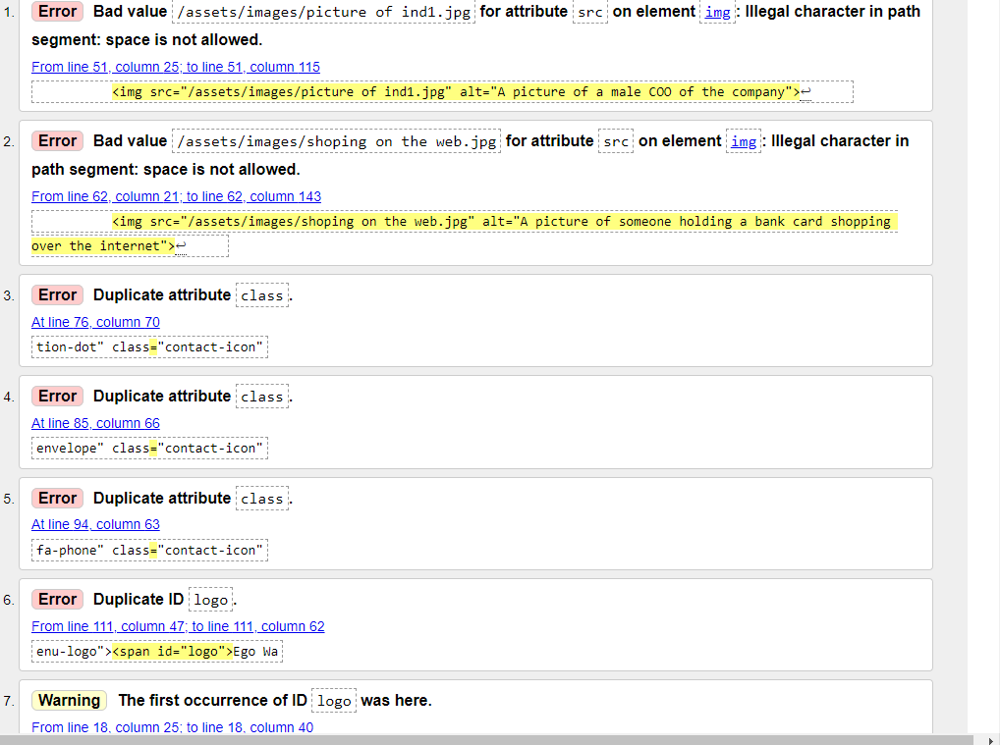
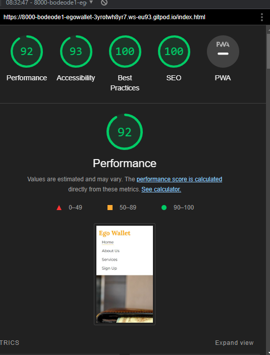

# Ego Wallet

Ego Wallet website introduces users, both business owners and individual customers, 
to the opportunity of launching an online store and for customers to access the marketplace 
and make purchases safely.

Visit the live website here! [Ego Wallet](https://bodeode1.github.io/Ego-Wallet-/)

## Features 
## * Navigation Bar
    The navigation bar featured all four pages which are all hypetext links to the logo, home page, services and sign-up page. 

    This section will allow users to navigate across all the pages of the website.

    
## * The Home Page
    The home page includes a background image with a text overlay that provides an introduction to the company's purpose.

## * The About Page
    The About page informs the user of the company's mission and the technology it provides to deliver its mission. This section also provides the company's contact details and then introduces the users to the executive team.

## * The Services Page
    The services page informs the users to create an account and contact the sales team for help. It also shows a youtube video that tells users they can sell anything on the company's platform.
    

## * Sign-Up Page 
    The sign-up page provides users with a form to fill out.

## *The Footer

    The footer section includes hypertext links to the relevant social medias sites for Ego Wallet. When clicked on, the links will open to a new tab to allow easy navigation between the all the pages of the website.

    

## * Features Left to implement

## 1 UX

    i.Ideal User Demographic
    ii. Current User
    iii. New User
    iv. Users include both business owners and shoppers.

    Current User Goals
    + A current user (shoppers) should be able to see when new lines of products are added.
    + A current user shoukd be able to log into their accounts and view transaction history, be able to cancel orders, able to request refund.
    + A current user shoukd be able to add funds to their digital wallet with ease and without glitches.

     New User Goals
    + Easy to navigate across the different pages of the website.
    + Ease with creating account and setting up online store for business owners.

## Issues and Bugs
    The developer ran into a number of bugs mostly duplication of codes.
    These erros were later fixed.

## Technology Used
    +HTML5
    +CSS3

## Frameworks, Libraries & Programs Used

    + Font Awesome. This was used to insert icons.

    + Google Fonts. Lato and Lora fonts were used.
    + Gitpod.Used for writing codes.
    + Balsamiq. Was used to create wireframes.

## Testing
    + Testing was done using W3s org.

    

## Typography
    lora and Mosterat was imprted from Google fonts.

## Acknowledgement
    My acknowledgment goes to my Mentor OluwasSeun Owonikoko.

## Deployment 
    + Log into Guthub.
    + Locate the Repository.
    + Settingsfrom the menu items.
    + Scroll down setting page to the pages section.
    + Under "Source Click drop-dowm menu labelled "None and select Main.
    + Upon Selection , the page will automatically refresh meaning that the website is nbow deployed.
    + Scroll back down to the pages section to retrieve the deployed link.
